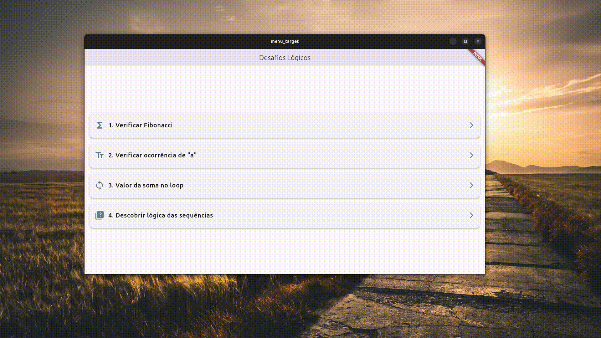
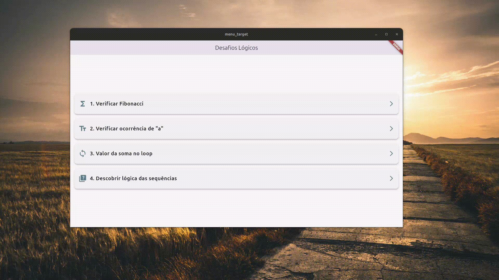
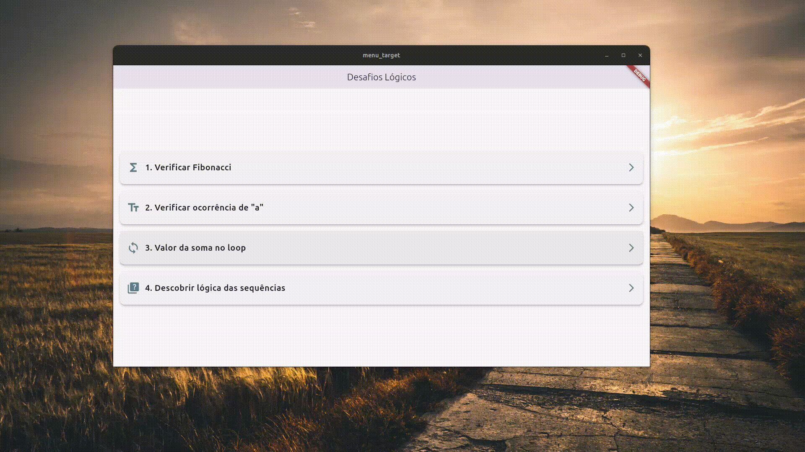

# Flutter App
## Requisitos Gerais

Antes de começar, certifique-se de que sua máquina atenda aos seguintes requisitos:

- **Flutter SDK**: Instale a versão mais recente do Flutter.
- **Android Studio**: Para compilar e rodar o app em dispositivos Android ou emuladores.
- **VS Code ou IntelliJ**: (Opcional) Para uma IDE com suporte ao Flutter/Dart.
- **Git**: Para clonar o repositório.

---

## Demonstração Visual

Aqui estão as capturas de tela e vídeos que ilustram o aplicativo em funcionamento:

### Organização dos Diretórios


### Tela de Home


### Vídeos Demonstrativos

1. **Verificar Fibonacci**
   
   Neste teste, foram inseridos os números 250 e 144. O número 250 retorna a mensagem "250 não pertence à sequência de Fibonacci", enquanto 144 pertence à sequência e retorna a mensagem adequada.
   
   

3. **Verificar Ocorrência de "a"**
   
   Foi inserido a palavra "homeOffice" para verificar quantas vezes a letra "a" aparece. O sistema analisa a string e exibe o resultado: "A letra 'a' aparece 0 vezes na string informada". Em seguida é inserido "casarao" retornando mensagem: "A letra 'a' aparece 3 vezes na string informada".
   
   

5. **Valor da Soma no Loop**

   Este exemplo demonstra a execução de um loop para calcular o valor final da variável SOMA. Foi realizado uma série de somas a partir de um loop onde a variável K é incrementada até um limite específico. O resultado final é exibido corretamente como 91, com um loop que acumula os valores da variável K até o índice 12.
   
   

7. **Descobrir Lógica das Sequências**

    O sistema apresenta diferentes tipos de sequências lógicas, como números ímpares, potências de dois, quadrados perfeitos e a sequência de Fibonacci. Para cada sequência, o sistema fornece a explicação detalhada de como os números são formados,         além de indicar qual é o próximo número esperado com base na lógica apresentada. A interface exibe claramente a sequência inicial, seguida de uma explicação e a resposta.
    
    As sequências incluem:
    
    - **a)** Números ímpares, onde o próximo número após 7 é 9.
    - **b)** Potências de 2, com o próximo valor sendo 128.
    - **c)** Quadrados perfeitos, com o próximo número sendo 49 (7^2).
    - **d)** Outra sequência de quadrados perfeitos começando de 2^2, onde o próximo é 100 (10^2).
    - **e)** Sequência de Fibonacci, com o próximo número sendo 13.
    - **f)** Sequência com padrão misto, onde o próximo número é 20.

   

---

## Etapas de Instalação no **Linux**

### 1. Instalar o Flutter SDK

1. Abra o terminal e instale as dependências necessárias:
    ```bash
    sudo apt update
    sudo apt install git curl cmake meson make clang libgtk-3-dev pkg-config
    ```

2. Clone o repositório Flutter:
    ```bash
    mkdir -p ~/development
    cd ~/development
    git clone https://github.com/flutter/flutter.git -b stable
    ```

3. Adicione o Flutter ao `PATH` do sistema:
    ```bash
    echo 'export PATH="$PATH:$HOME/development/flutter/bin"' >> ~/.bashrc
    source ~/.bashrc
    ```

4. Verifique se o Flutter foi instalado corretamente:
    ```bash
    flutter doctor
    ```

### 2. Instalar o Android Studio

1. Baixe e instale o **Android Studio**. Siga as instruções no site oficial:  
   [Download Android Studio](https://developer.android.com/studio).

2. Após a instalação, abra o **Android Studio** e siga as instruções para instalar o **Android SDK** e outras dependências necessárias.

3. Configure o emulador Android no **AVD Manager**:
   - Vá para **Configure > AVD Manager** e crie um novo emulador Android.

4. Aceite as licenças necessárias:
    ```bash
    flutter doctor --android-licenses
    ```

### 3. Configurar o Android SDK no `PATH`

1. Abra o terminal e edite o arquivo `~/.bashrc` para adicionar o Android SDK ao `PATH`:
    ```bash
    nano ~/.bashrc
    ```

2. Adicione as seguintes linhas:
    ```bash
    export ANDROID_HOME=$HOME/Android/Sdk
    export PATH=$PATH:$ANDROID_HOME/emulator
    export PATH=$PATH:$ANDROID_HOME/tools
    export PATH=$PATH:$ANDROID_HOME/tools/bin
    export PATH=$PATH:$ANDROID_HOME/platform-tools
    ```

3. Atualize o terminal:
    ```bash
    source ~/.bashrc
    ```

### 4. Clonar o Repositório

1. Clone o repositório do projeto na sua máquina:
    ```bash
    git clone https://github.com/seu_usuario/seu_repositorio.git
    cd seu_repositorio
    ```

### 5. Instalar as Dependências do Flutter

1. No diretório do projeto, execute o comando abaixo para instalar as dependências descritas no arquivo `pubspec.yaml`:
    ```bash
    flutter pub get
    ```

### 6. Rodar o Projeto

1. Para rodar o projeto em um emulador ou dispositivo físico, certifique-se de que o emulador esteja ativo ou que o dispositivo esteja conectado.

2. Execute o projeto com o seguinte comando:
    ```bash
    flutter run
    ```

---

## Etapas de Instalação no **Windows**

### 1. Instalar o Flutter SDK

1. Baixe o SDK do Flutter no site oficial:  
   [Download Flutter SDK](https://flutter.dev/docs/get-started/install/windows)

2. Extraia o conteúdo do arquivo baixado para uma pasta, por exemplo:  
   `C:\src\flutter`

3. Adicione o Flutter ao `PATH` do Windows:
    - Abra **Painel de Controle > Sistema e Segurança > Sistema**.
    - Clique em **Configurações avançadas do sistema**.
    - No campo **Variáveis de Ambiente**, edite a variável `PATH`.
    - Adicione o caminho `C:\src\flutter\bin`.

4. Verifique a instalação do Flutter:
    - Abra o **PowerShell** ou o **Prompt de Comando** e execute:
      ```bash
      flutter doctor
      ```

### 2. Instalar o Android Studio

1. Baixe e instale o **Android Studio** do site oficial:  
   [Download Android Studio](https://developer.android.com/studio).

2. Durante a instalação, selecione a opção para instalar o **Android SDK** e o **Android Virtual Device** (AVD).

3. Após a instalação, configure o emulador no **AVD Manager**:
   - Vá para **Configure > AVD Manager** e crie um novo emulador Android.

4. Aceite as licenças necessárias:
    - No **PowerShell** ou **Prompt de Comando**, execute:
      ```bash
      flutter doctor --android-licenses
      ```

### 3. Clonar o Repositório

1. Abra o **Git Bash** ou o **PowerShell** e clone o repositório do projeto:
    ```bash
    git clone https://github.com/seu_usuario/seu_repositorio.git
    cd seu_repositorio
    ```

### 4. Instalar as Dependências do Flutter

1. No diretório do projeto, execute o seguinte comando para instalar as dependências descritas no arquivo `pubspec.yaml`:
    ```bash
    flutter pub get
    ```

### 5. Rodar o Projeto

1. Certifique-se de que o emulador Android ou um dispositivo físico esteja conectado.

2. No **PowerShell** ou **Git Bash**, execute:
    ```bash
    flutter run
    ```

---

## Usar VS Code (Opcional)

1. Se você estiver usando o **VS Code** como editor, instale as extensões do Flutter e Dart:
    - Abra o VS Code.
    - Vá para o **Gerenciador de Extensões** (`Ctrl + Shift + X`).
    - Pesquise por **Flutter** e **Dart**, e instale as extensões.

2. Abra o projeto no VS Code:
    ```bash
    code .
    ```

---

## Verificar Dependências

1. Se houver algum problema com dependências, execute o `flutter doctor` para verificar as configurações do ambiente:
    ```bash
    flutter doctor
    ```

---

